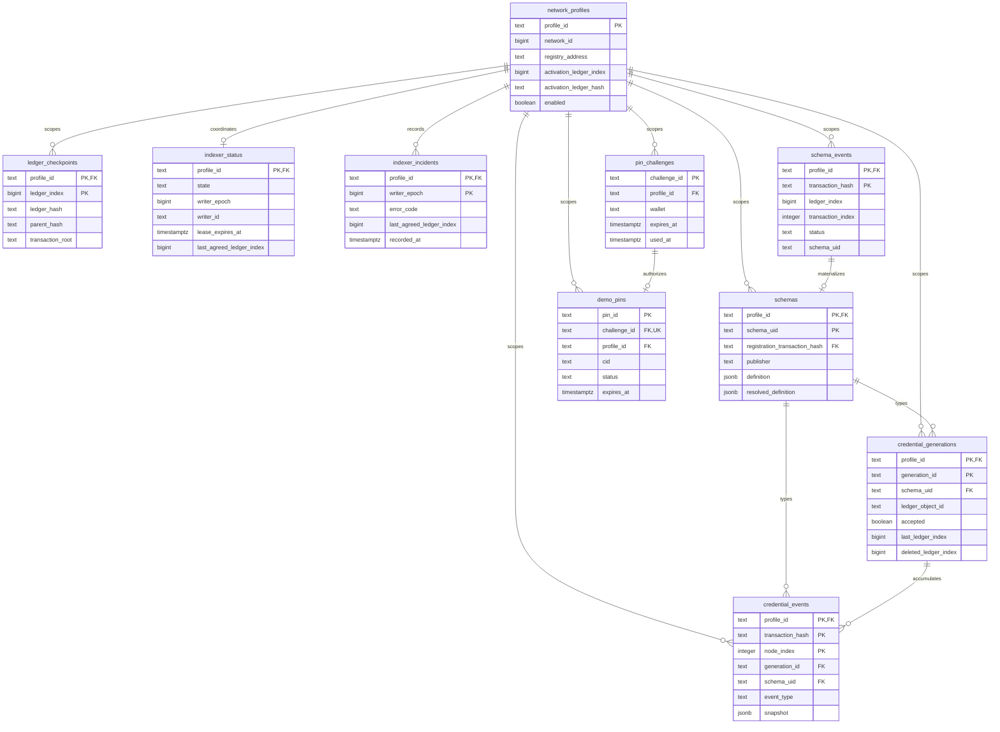

# Database model

PostgreSQL is a rebuildable read model of validated XRP Ledger history. It is not the source of XCS
protocol truth and it stores neither XRPL signing keys nor Credential claim payloads. The application
schema contains ten tables grouped around network evidence, indexer coordination, schema discovery,
Credential lifecycle projection, and optional demo pinning.

The Drizzle bookkeeping table in the internal `drizzle` schema is not part of the application model.

## Relationship map

The diagram shows foreign-key relationships and the columns that are most useful when navigating the
model. It deliberately omits secondary indexes, timestamps, and some payload columns; the generated
baseline remains the complete DDL.

All ledger-derived composite keys begin with `profile_id`. This makes the network profile an explicit
part of row identity instead of relying on process configuration to keep different ledgers apart.
Foreign keys use restrictive deletion: projection history is rebuilt as a unit rather than partially
cascaded away.

## Table catalog

| Domain           | Table                    | Purpose                                                                                                        | Normal mutation pattern                                               |
| ---------------- | ------------------------ | -------------------------------------------------------------------------------------------------------------- | --------------------------------------------------------------------- |
| Network evidence | `network_profiles`       | Network, registry, activation, and protocol-version boundary used by every projection.                         | Insert during profile initialization; `enabled` is operational state. |
| Network evidence | `ledger_checkpoints`     | Canonical ledger hash chain, transaction root, close time, and transaction count used to prove API freshness.  | Append once per processed validated ledger.                           |
| Indexer control  | `indexer_status`         | One row per profile containing quorum progress, live writer lease, fencing epoch, and halt state.              | Insert once; update only through fenced coordination operations.      |
| Indexer control  | `indexer_incidents`      | Durable record of each fenced halt and the source tips that caused it.                                         | Append-only, keyed by profile and writer epoch.                       |
| Schema catalog   | `schema_events`          | Accepted and rejected schema-registration transactions with their ledger ordering and parsed memo evidence.    | Append-only event history.                                            |
| Schema catalog   | `schemas`                | Materialized, searchable catalog of accepted schemas, including original and inheritance-resolved definitions. | Insert when an accepted registration event is projected.              |
| Credentials      | `credential_generations` | Current state of one logical Credential generation, including acceptance and deletion state.                   | Insert on creation; column-limited updates on later lifecycle events. |
| Credentials      | `credential_events`      | Immutable creation, acceptance, and deletion evidence plus the resulting ledger-node snapshot.                 | Append-only event history.                                            |
| Demo pinning     | `pin_challenges`         | Short-lived, wallet-bound challenge preventing unauthenticated pin requests and replay.                        | Created, marked used, and expired by the API.                         |
| Demo pinning     | `demo_pins`              | Operational state for the optional Testnet payload-pinning convenience service.                                | API-managed lifecycle from pending to pinned, failed, or unpinned.    |

`schema_events` and `credential_events` preserve what the indexer observed. `schemas` and
`credential_generations` are query-oriented projections derived from those events. A replay can
therefore reconstruct current state while checkpoints provide the ledger boundary for comparing two
finite replays.

## Integrity and transaction boundaries

- Hashes, ledger indexes, addresses, statuses, event shapes, lifecycle ordering, and one-live-
  Credential-per-tuple rules are enforced by database constraints.
- A schema row references the registration event that produced it. Credential generations and events
  reference their schema, and every Credential event references its generation.
- Projection writes, the corresponding checkpoint, and published indexer status commit in the same
  fenced transaction. A stale writer epoch cannot commit partial state after lease takeover.
- A halt status and its durable `indexer_incidents` row commit atomically.
- API authoritative reads use one read-only, repeatable-read transaction so status, checkpoint, and
  projection evidence describe the same database snapshot.
- Pinning tables are operational convenience data and are isolated from ledger-derived protocol
  projections.

## Database roles

| Role          | Application-table access                                                                                                      | Intended lifetime                                   |
| ------------- | ----------------------------------------------------------------------------------------------------------------------------- | --------------------------------------------------- |
| `xcs_admin`   | Owns the schema and grants; unrestricted bootstrap access.                                                                    | One-shot bootstrap and controlled maintenance only. |
| `xcs_indexer` | Reads and inserts ledger-derived rows; receives column-limited updates only on `indexer_status` and `credential_generations`. | Indexer runtime.                                    |
| `xcs_api`     | Reads ledger-derived projections and manages only `pin_challenges` and `demo_pins`.                                           | API runtime.                                        |
| `xcs_monitor` | No application-table DML; inherits PostgreSQL's `pg_monitor` role.                                                            | Metrics collection.                                 |

Runtime roles own no objects, cannot create database objects, are not superusers, and have finite
connection limits and statement timeouts. Bootstrap requires an explicit dedicated-cluster
acknowledgement because PostgreSQL roles are cluster-wide.

## Schema ownership and bootstrap

The Drizzle source is split by domain:

- [`profiles.ts`](../packages/db/src/schema/profiles.ts): network profiles and ledger checkpoints.
- [`indexer.ts`](../packages/db/src/schema/indexer.ts): writer status and durable incidents.
- [`catalog.ts`](../packages/db/src/schema/catalog.ts): schema registration events and catalog rows.
- [`credentials.ts`](../packages/db/src/schema/credentials.ts): Credential history and current state.
- [`pinning.ts`](../packages/db/src/schema/pinning.ts): optional demo-pinning administration.

[`0000_baseline.sql`](../packages/db/drizzle/0000_baseline.sql) is generated from those modules and
creates the entire schema for an empty database. [`bootstrap.ts`](../packages/db/src/bootstrap.ts)
applies that baseline and then normalizes the fixed runtime roles and grants. Both operations are
idempotent, so starting the stack again is safe.

Until the first production release, schema changes regenerate the baseline and disposable databases
are recreated. The baseline freezes at production launch; later schema changes must use forward
migrations rather than rewriting deployed history.
