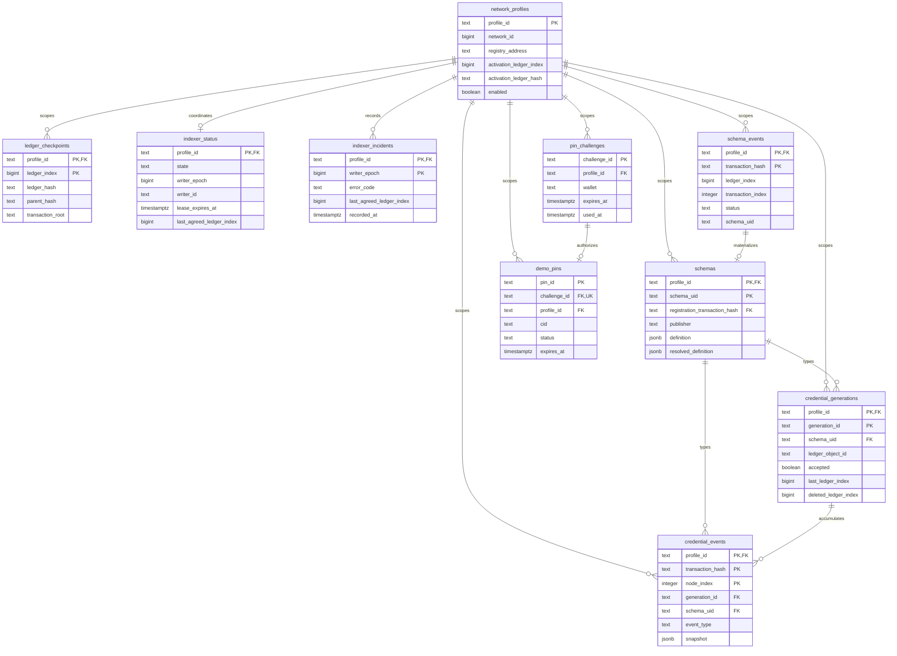

# Database model

PostgreSQL contains a rebuildable read model of validated XRP Ledger history plus the optional
role-based application's workflow state. It is not the source of XCS protocol truth and never stores
XRPL signing keys. Managed private claim payloads are encrypted-at-rest application data in
`app_issuer_payloads`; private review documents live in the configured filesystem or S3/Spaces
backend, with only their metadata stored in PostgreSQL.

The ten protocol-projection tables below cover network evidence, indexer coordination, schema
discovery, Credential lifecycle projection, and optional demo pinning. Migrations `0003` through
`0008` add the account, Commons review, issuer, recipient, verifier and wallet-proof tables described
in [the application database model](database-app.md).

The Drizzle bookkeeping table in the internal `drizzle` schema is not part of the application model.

## Relationship map

The diagram shows foreign-key relationships and the columns that are most useful when navigating the
model. It deliberately omits secondary indexes, timestamps, and some payload columns; the generated
baseline remains the complete DDL.


```mermaid
erDiagram
    network_profiles ||--o{ ledger_checkpoints : scopes
    network_profiles ||--o| indexer_status : coordinates
    network_profiles ||--o{ indexer_incidents : records
    network_profiles ||--o{ schema_events : scopes
    network_profiles ||--o{ schemas : scopes
    network_profiles ||--o{ credential_generations : scopes
    network_profiles ||--o{ credential_events : scopes
    network_profiles ||--o{ pin_challenges : scopes
    network_profiles ||--o{ demo_pins : scopes

    schema_events ||--o| schemas : materializes
    schemas ||--o{ credential_generations : types
    schemas ||--o{ credential_events : types
    credential_generations ||--o{ credential_events : accumulates
    pin_challenges ||--o| demo_pins : authorizes

    network_profiles {
        text profile_id PK
        bigint network_id
        text registry_address
        bigint activation_ledger_index
        text activation_ledger_hash
        boolean enabled
    }

    ledger_checkpoints {
        text profile_id PK, FK
        bigint ledger_index PK
        text ledger_hash
        text parent_hash
        text transaction_root
    }

    indexer_status {
        text profile_id PK, FK
        text state
        bigint writer_epoch
        text writer_id
        timestamptz lease_expires_at
        bigint last_agreed_ledger_index
    }

    indexer_incidents {
        text profile_id PK, FK
        bigint writer_epoch PK
        text error_code
        bigint last_agreed_ledger_index
        timestamptz recorded_at
    }

    schema_events {
        text profile_id PK, FK
        text transaction_hash PK
        bigint ledger_index
        integer transaction_index
        text status
        text schema_uid
    }

    schemas {
        text profile_id PK, FK
        text schema_uid PK
        text registration_transaction_hash FK
        text publisher
        jsonb definition
        jsonb resolved_definition
    }

    credential_generations {
        text profile_id PK, FK
        text generation_id PK
        text schema_uid FK
        text ledger_object_id
        boolean accepted
        bigint last_ledger_index
        bigint deleted_ledger_index
    }

    credential_events {
        text profile_id PK, FK
        text transaction_hash PK
        integer node_index PK
        text generation_id FK
        text schema_uid FK
        text event_type
        jsonb snapshot
    }

    pin_challenges {
        text challenge_id PK
        text profile_id FK
        text wallet
        timestamptz expires_at
        timestamptz used_at
    }

    demo_pins {
        text pin_id PK
        text challenge_id FK, UK
        text profile_id FK
        text cid
        text status
        timestamptz expires_at
    }
```

All ledger-derived composite keys begin with `profile_id`. This makes the network profile an explicit
part of row identity instead of relying on process configuration to keep different ledgers apart.
Foreign keys use restrictive deletion: projection history is rebuilt as a unit rather than partially
cascaded away.

## Table catalog

| Domain           | Table                    | Purpose                                                                                                            | Normal mutation pattern                                                |
| ---------------- | ------------------------ | ------------------------------------------------------------------------------------------------------------------ | ---------------------------------------------------------------------- |
| Network evidence | `network_profiles`       | Network, registry, activation, and protocol-version boundary used by every projection.                             | Insert during profile initialization; `enabled` is operational state.  |
| Network evidence | `ledger_checkpoints`     | Canonical ledger hash chain, transaction root, close time, and transaction count used to prove read-API freshness. | Append once per processed validated ledger.                            |
| Indexer control  | `indexer_status`         | One row per profile containing quorum progress, live writer lease, fencing epoch, and halt state.                  | Insert once; update only through fenced coordination operations.       |
| Indexer control  | `indexer_incidents`      | Durable record of each fenced halt and the source tips that caused it.                                             | Append-only, keyed by profile and writer epoch.                        |
| Schema catalog   | `schema_events`          | Accepted and rejected schema-registration transactions with their ledger ordering and parsed memo evidence.        | Append-only event history.                                             |
| Schema catalog   | `schemas`                | Materialized, searchable catalog of accepted schemas, including original and inheritance-resolved definitions.     | Insert when an accepted registration event is projected.               |
| Credentials      | `credential_generations` | Current state of one logical Credential generation, including acceptance and deletion state.                       | Insert on creation; column-limited updates on later lifecycle events.  |
| Credentials      | `credential_events`      | Immutable creation, acceptance, and deletion evidence plus the resulting ledger-node snapshot.                     | Append-only event history.                                             |
| Demo pinning     | `pin_challenges`         | Short-lived, wallet-bound challenge preventing unauthenticated pin requests and replay.                            | Created, marked used, and expired by the web app.                      |
| Demo pinning     | `demo_pins`              | Operational state for the optional Testnet payload-pinning convenience service.                                    | Web-app-managed lifecycle from pending to pinned, failed, or unpinned. |

`schema_events` and `credential_events` preserve what the indexer observed. `schemas` and
`credential_generations` are query-oriented projections derived from those events. A replay can
therefore reconstruct current state while checkpoints provide the ledger boundary for comparing two
finite replays.

## Integrity and transaction boundaries

- Hashes, ledger indexes, addresses, statuses, event shapes, lifecycle ordering, and one-live-
  Credential-per-tuple rules are enforced by database constraints.
- A schema row references the registration event that produced it. Credential generations and events
  reference their schema, and every Credential event references its generation.
- Projection writes, the corresponding checkpoint, and published indexer status commit in the same
  fenced transaction. A stale writer epoch cannot commit partial state after lease takeover.
- A halt status and its durable `indexer_incidents` row commit atomically.
- The web app's authoritative reads use one read-only, repeatable-read transaction so status, checkpoint, and
  projection evidence describe the same database snapshot.
- Pinning tables are operational convenience data and are isolated from ledger-derived protocol
  projections.

## Database roles

| Identity / role       | Access boundary                                                                                                                        | Intended lifetime                               |
| --------------------- | -------------------------------------------------------------------------------------------------------------------------------------- | ----------------------------------------------- |
| Bootstrap provisioner | Owns migrations and grants; requires DDL rights plus authority to administer the eight pre-created roles on the dedicated XCS cluster. | PRE_DEPLOY job and controlled maintenance only. |
| `xcs_indexer`         | Reads and inserts ledger-derived rows; receives column-limited updates only on `indexer_status` and `credential_generations`.          | Indexer runtime.                                |
| `xcs_api`             | Read-only access to public ledger projections.                                                                                         | Web app public `/v1` API pool.                  |
| `xcs_payload_writer`  | Writes hosted public payloads, publication records, demo pin challenges and pins.                                                      | Web app publication pool.                       |
| `xcs_monitor`         | No application-table DML; inherits PostgreSQL's `pg_monitor` role.                                                                     | Metrics collection.                             |
| `xcs_app`             | Accounts, OIDC sessions, wallet-link challenges and proven wallet records.                                                             | Web app authentication pool.                    |
| `xcs_admin_app`       | Commons application review, audit decisions and notification outbox creation.                                                          | Web app administrator pool.                     |
| `xcs_notifier`        | Claims and updates Commons notification outbox rows.                                                                                   | Notifier worker.                                |
| `xcs_issuer`          | Issuer applications, invitations, managed credentials, recipient access and presentations.                                             | Web app role-workspace pool.                    |

Runtime roles own no objects and must be normal managed users with `LOGIN` and no elevated role
attributes or unexpected memberships. The managed service creates them and owns their passwords;
bootstrap validates that boundary, applies grants and attempts bounded connection limits and timeout
defaults. Providers may refuse those resource controls or the `pg_monitor` membership without
rolling back the grants, so bootstrap reports every control that remains unapplied. It requires an
explicit dedicated-cluster acknowledgement because PostgreSQL roles are cluster-wide.

## Schema ownership, migrations and bootstrap

The schema lives in `db/`, which is **not a package**: it has no `package.json`, no build and no
version. Both applications compile its files as their own sources through the `#db/*` path alias
(`#db/schema` → `db/schema/index.ts`), so both pin the same `drizzle-orm` version. It is the only
code `apps/web` and `apps/indexer` share; everything else is copied by hand (see
[`CONTRIBUTING.md`](../CONTRIBUTING.md)).

The Drizzle source is split by domain:

- [`profiles.ts`](../db/schema/profiles.ts): network profiles and ledger checkpoints.
- [`indexer.ts`](../db/schema/indexer.ts): writer status and durable incidents.
- [`catalog.ts`](../db/schema/catalog.ts): schema registration events and catalog rows.
- [`credentials.ts`](../db/schema/credentials.ts): Credential history and current state.
- [`pinning.ts`](../db/schema/pinning.ts): optional demo-pinning administration.

Generated SQL migrations live in [`db/migrations/`](../db/migrations); `migrations/meta/_journal.json`
is the applied-migration ledger and must stay append-only. The complete `0000`–`0008` journal creates
the protocol projection and role-based application schema for an empty database.

### PostgreSQL is external

PostgreSQL is provisioned outside this repository — a managed instance, or a cluster an operator
runs. Nothing here creates or owns the server. The repository's Compose stack includes a PostgreSQL
container for **local development only**; it is not a deployment topology.

### The indexer owns the tooling

`drizzle-kit` and the migration runner are devDependencies of `apps/indexer` only. The web app has
no migration command: it connects to an already-migrated database as `xcs_api`.

Generate a migration after editing `db/schema/`, and commit both the SQL file and the updated
snapshot — CI regenerates and fails on any diff:

```sh
pnpm --dir apps/indexer db:generate
```

Apply migrations to an existing database:

```sh
XCS_BOOTSTRAP_DATABASE_URL=postgres://xcs_admin:…@host:5432/xcs \
  pnpm --dir apps/indexer db:migrate
```

This is idempotent: `drizzle-orm`'s migrator records applied migrations in
`drizzle.__drizzle_migrations` and a second run applies nothing. The migration folder defaults to
`db/migrations` relative to the indexer application and can be overridden with `XCS_MIGRATIONS_DIR`
(the container image sets it to the copy of `db/migrations` beside the built application).

### Bootstrap and migrate atomically

`db:bootstrap` is migration plus grants. Before the PRE_DEPLOY job, create all eight runtime users
through DigitalOcean: `xcs_indexer`, `xcs_api`, `xcs_payload_writer`, `xcs_monitor`, `xcs_app`,
`xcs_admin_app`, `xcs_notifier` and `xcs_issuer`. DigitalOcean owns their generated passwords.

```sh
XCS_BOOTSTRAP_DATABASE_URL=postgres://xcs_admin:…@host:5432/xcs \
  XCS_DATABASE_CLUSTER_SCOPE=dedicated \
  pnpm --dir apps/indexer db:bootstrap
```

It checks that all eight managed users exist before any DDL, applies migrations 0000–0008, then
normalizes attributes and least-privilege grants in one administrative transaction. It never creates
a role or reads, sets, resets or rotates a password. The command is idempotent.
`XCS_DATABASE_CLUSTER_SCOPE=dedicated` is required because PostgreSQL login roles are cluster-wide
even though the grants are scoped to the selected database. Bootstrap reports role names or a stable
failure code, never URLs or password values.

Until the first production release, disposable databases are recreated rather than upgraded in place.
The migration history freezes at production launch; after that, every schema change is a reviewed
forward migration with an explicit compatibility, lock, backup and rollback plan. Never edit an
applied migration — add a new one.
