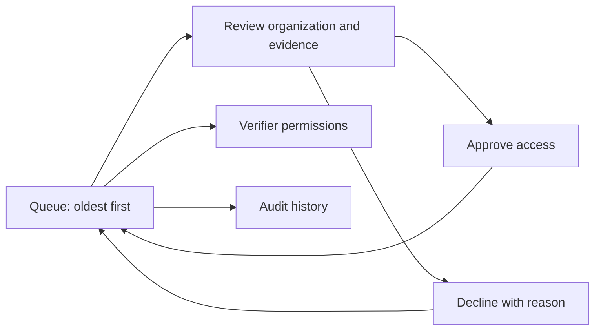

# Admin — review an organization and grant access

Draft for [#30](https://github.com/XRPL-Commons/XCS/issues/30).

User goal: “I want to decide who can use issuer or verifier features, with enough evidence to
explain my decision.” Approval is application access, not endorsement of an issuer's claims.

[French board](./wireframes.fr.excalidraw) · [English board](./wireframes.en.excalidraw) ·
[Gallery](../index.html#admin)

## Journey and screens

| Screen / suggested route                    | Question answered                                                       | Main action and data                                          | Exit                               |
| ------------------------------------------- | ----------------------------------------------------------------------- | ------------------------------------------------------------- | ---------------------------------- |
| [A1](./a1.fr.svg) `/admin`                  | What needs my attention?                                                | Oldest pending applications; role filter and counts; open one | A2                                 |
| [A2](./a2.fr.svg) `/admin/applications/:id` | Is this organization who it says it is, and which access am I granting? | Profile, documents, wallets, timeline; approve or decline     | Queue updates and announces result |
| [A3](./a3.fr.svg) `/admin/verifiers`        | Is this verifier still approved to use the portal?                      | Global approval state; confirm suspension or restoration      | Updated approval and audit entry   |
| [A4](./a4.fr.svg) `/admin/audit`            | Who changed access, and why?                                            | Actor, target, time, before/after and reason; metadata only   | Back to queue                      |

A2 opens documents in a new tab through an expiring authorized URL, announced in the link label.
Decline expands a required reason field on A2; missing reason stays on the same screen with a field
error. Approval previews the exact role. Both actions disable while pending, then return to the
same queue position. Concurrent review shows the already-recorded decision rather than overwriting
it. Document-access errors retain the application and offer retry; never approve automatically.

## Remove unnecessary work

There is no existing admin screen. Current ledger pages expose raw addresses and identifiers but
cannot establish an organization's identity. Do not repurpose them as an approval console.

| Information                           | Source / handling                                                             |
| ------------------------------------- | ----------------------------------------------------------------------------- |
| User ID, application ID, reviewer ID  | Session and selected record; never typed                                      |
| Organization and supporting documents | Application form from issuer/verifier                                         |
| Role and current state                | Application; preview before approving                                         |
| Reason for refusal                    | Admin must supply; never inferred                                             |
| Verifier approval target              | Select the verifier application identity, not a raw address or an issuer list |

## Failure, empty and authorization states

- Empty queue: “No applications to review” / “Aucune demande à examiner”; link to audit history.
- Session expired/non-admin: sign in or a clear access-denied page, no redirect loop and no profile
  data in the response. Deep links must enforce the same check as the workspace.
- Wallet missing (F1): does not block reviewing application documents; never asks the admin to sign
  an XRPL transaction. Applicant wallet incompleteness is visible only when relevant to the role.
- Invite unusable (F2): not an approval prerequisite; do not conflate recipient invites with role
  applications or repair invites by changing role approval.
- Indexer unavailable (F3): app-only document review may continue; ledger-dependent evidence is
  unavailable, never “verified”. Approval cannot invent that evidence.
- Notification failure: decision remains recorded once; show notification pending and offer a safe
  retry. Do not repeat the approval to resend mail.

## Review and acceptance tasks

Two admin participants each review one complete issuer application, decline another with a reason,
and suspend a verifier's global approval. Observe time to first decision (target under one minute
after opening a complete application), whether “approval ≠ endorsement” is understood, and whether
they understand that only a recipient can grant that designated verifier private-claim access.
Record results in [the session log](../usability.md). ADR 0004 supersedes #30's issuer-allowlist UI;
do not implement that screen or give admins a private-claim override.

#30 must test non-admin page/API rejection, audit before/after records, exact notification behavior,
concurrent review, expiring document links and access revocation. Its implementation screen set is
A1–A4; shared patterns apply. No usability approval has been obtained yet.
