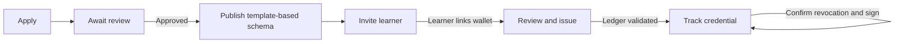

# Issuer — from application to a recipient's credential

Draft for [#31](https://github.com/XRPL-Commons/XCS/issues/31).

User goal: “I want to give a learner an attestation without learning ledger identifiers or handling
their wallet.” Example: fictional Atelier Exemple, course completion, learner Camille Exemple.

[French board](./wireframes.fr.excalidraw) · [English board](./wireframes.en.excalidraw) ·
[Gallery](../index.html#issuer)

## Journey and screens

| Screen / suggested route                    | User question                                 | Action and state                                                                            |
| ------------------------------------------- | --------------------------------------------- | ------------------------------------------------------------------------------------------- |
| [I1](./i1.fr.svg) `/issuer/apply`           | What must I provide?                          | Organization, website, contact, jurisdiction, purpose and document upload; apply            |
| [I2](./i2.fr.svg) `/issuer/application`     | Can I issue yet?                              | Pending/declined/approved status; reason and next step; no issuance while pending           |
| [I3](./i3.fr.svg) `/issuer/schemas/new`     | What will this attestation contain?           | Course/diploma template, plain-language field types; preview and publish using wallet       |
| [I4](./i4.fr.svg) `/issuer/recipients`      | Who should receive it and are they ready?     | Email, own schema, optional message; invite list, resend/revoke and readiness               |
| [I5](./i5.fr.svg) `/issuer/issue/:inviteId` | Exactly what am I signing and who can see it? | Derived subject/schema; fill claims; select public/private subset; review fee and sign      |
| [I6](./i6.fr.svg) `/issuer/credentials/:id` | Has it been accepted, and can I revoke it?    | Validated issuance, subject acceptance and publication separately; revoke with confirmation |

The `/issuer` workspace opens the schemas/recipients/credentials tabs represented by I3–I6; settings
links to the existing application profile and linked-wallet settings once #27 exists. Schema
publication and issuance reuse the current engine rather than duplicating it.

I3's template uses course title (text), completion date (date) and learner name (text); it explains
which fields are required. The diploma alternative uses qualification, award date and institution.
Advanced schema JSON is optional, not a first screen. On publish, keep the chosen schema and derived
UID together. I4 only offers the issuer's schemas and enables issuance after verified wallet linking.

Invitation delivery email is not proof of the claimant's identity. Under ADR 0004's link-possession
policy, an authenticated holder may claim a forwarded invitation. I5 must show the actual claimant
and proven wallet for issuer review before signature, distinct from the delivery email.

I5 defaults to a proposed private setting with no public claim fields selected; the issuer must
review it. A two-column preview (“Anyone with the link” / “Authorized people”) shows each subset
before signing. The private option stays blocked until authorized private hosting exists. Public
selection clearly states that publication cannot be made private later. Schema, recipient, claim
values, visibility and fee remain visible in the final summary; raw transaction JSON is secondary.

I6 treats “issued on ledger, payload publication pending” as incomplete, not “ready to accept”.
Retry publication for the original operation; do not issue again. Revocation requires a confirmation
that identifies the learner and schema, then wallet approval and validated evidence. Cancellation
returns to the same detail screen; failed or unknown results reconcile the original operation.

## Current asks → proposed simplification

| Today in `/schemas/register` or `/issue`              | Proposed role flow                                                          |
| ----------------------------------------------------- | --------------------------------------------------------------------------- |
| Registry/network profile and canonical schema details | Configured Testnet profile; expand technical details only                   |
| Schema UID                                            | Select an owned schema by name; derive UID                                  |
| Subject address                                       | Claimed invite's verified wallet; never ask issuer to paste it              |
| Claims JSON                                           | Labelled template fields with local validation; advanced view optional      |
| Payload URL / hosting and digest                      | Managed private hosting when available; human-readable visibility preview   |
| Expiration timestamp                                  | Template suggestion, editable before signing; show exact date and timezone  |
| Transaction blob/hash and confirmation                | Human-readable approval, then pending/validated state and optional evidence |

## Failure and empty states

- No schemas: offer I3; no recipients: offer I4; claimed but no linked wallet: “Waiting for learner”
  / “En attente du destinataire”. No synthetic recipient address fallback.
- Missing wallet (F1): retain non-sensitive schema draft; install/unlock/select compatible wallet.
- Expired invitation (F2): show expired in I4, explicitly revoke/replace; never issue to a stale link.
- Indexer unavailable (F3): browsing app-owned drafts can continue; publish/issue/revoke are disabled
  until fresh checks. Pending transactions use recovery, not another wallet prompt.
- Wallet rejection/network/account change: preserve the human-readable draft and recheck identity
  before another signature. No success toast.
- Declined application: show reason and contact/reapplication policy once decided; do not promise
  an automatic appeal endpoint. Uploaded documents are not public credential claims.

## Review and acceptance tasks

Two issuer participants apply, choose the course template, invite a learner, explain both visibility
previews, then issue after the supplied “wallet linked” fixture. Probe an expired invite, wallet
absence and publication pending. Success means no UID/address entry, accurate explanation of who
sees the learner's name, and no duplicate issuance during recovery.

#31 implements I1–I6 with shared F1–F3, private-storage authorization, own-schema filtering and ledger
evidence. Keep the accountless Studio until ADR 0004 explicitly retires it. Participant observations
and maintainer acceptance are still pending in [the session log](../usability.md).
