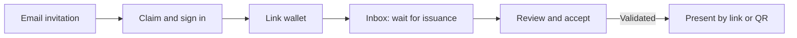

# Recipient — claim, accept and share deliberately

Draft for [#32](https://github.com/XRPL-Commons/XCS/issues/32).

User goal: “I want to receive my attestation and show the right information to someone checking it.”

[French board](./wireframes.fr.excalidraw) · [English board](./wireframes.en.excalidraw) ·
[Gallery](../index.html#recipient)

## Journey and screen budget

Four application screens from email to acceptance (R1–R4); presenting adds R5. The externally owned
XRP Identity and wallet consent/install screens are explicit handoffs, not hidden steps in this
count. Measure both application-screen count and real handoff effort during tests; the five-screen
goal must not conceal a difficult wallet setup. There may be a wait for issuer action after R2.

| Screen / suggested route                               | Question answered                             | Main action                                                                               |
| ------------------------------------------------------ | --------------------------------------------- | ----------------------------------------------------------------------------------------- |
| [R1](./r1.fr.svg) `/invites/:token`                    | Who is offering me what?                      | Sign in with XRP Identity and claim invite; confirm intended account                      |
| [R2](./r2.fr.svg) `/recipient/wallet`                  | Why do I need a wallet, and is mine ready?    | Select compatible wallet; prove ownership with a nonce challenge, not a transaction       |
| [R3](./r3.fr.svg) `/recipient`                         | Is my attestation ready?                      | Waiting, ready to accept, accepted and inactive sections; select one                      |
| [R4](./r4.fr.svg) `/recipient/credentials/:id`         | What will accepting do?                       | Inspect issuer and ledger metadata; consent to read content; review and accept or decline |
| [R5](./r5.fr.svg) `/recipient/credentials/:id/present` | Who can see what, and how can I stop sharing? | Choose scope and designated verifier for private access; link/QR; list and revoke grants  |

R1 reveals only minimal invitation context before authentication. Under the updated ADR 0004,
possession of a valid invitation permits an authenticated account to claim it without matching the
delivery email. Opening is read-only; claiming is explicit and atomic. A forwarded unclaimed link
can be claimed first by its holder, but an already claimed link cannot reassign the claimant.
Explain this before confirmation and let the issuer review the actual claimant and proven wallet
before signing. Claiming is not email verification. Avoid account-existence disclosures in errors.

R2 explains wallet custody and address visibility in ordinary language. Installation guidance must
come from the maintained adapter compatibility list, not a promise that every wallet works. The
ownership challenge can never be submitted as an XRPL transaction. Connecting is not linking;
server verification of the current nonce completes the step and informs the issuer.

R4 has two phases on the same screen. Before fetch, show host, issuer and basic ledger evidence with
“Read attestation content” consent. Decline remains possible without any payload request. After
consent and integrity checks, show claims and the signing preview. Acceptance requires a current
valid review and subject wallet; declining signs the existing subject-delete flow and never fetches
payload. Warn that either signing action may incur the displayed fee. A canceled wallet prompt
changes nothing; an unresolved transaction remains pending. Announce accepted only after validation.

Preserve the existing trust guard: an `untrusted` issuer blocks acceptance; `unknown` requires an
explicit acknowledgement for this exact issuer, subject, generation and network profile. Copy:
“I have checked this issuer and choose to accept” / “J’ai vérifié cet émetteur et je choisis
d’accepter”. This does not change the issuer's global trust status. Recheck after the wallet returns.
If generation, host, account, network or trust changes, invalidate the preview/consent and show
“The attestation changed; review it again” / “L’attestation a changé ; examinez-la à nouveau”.
Declining stays possible on current ledger metadata without payload access or a trust acknowledgement.

R5 defaults to public scope. Selecting private/full sharing requires choosing one globally approved
verifier organization, bound server-side to its stable application identity. Preview that audience
and the authorized fields before creation; a forwarded link cannot authorize another verifier.
The R5 wireframe illustrates this full-sharing selection with name, course and completion date.
The public-only default instead previews only the public fields and does not need a verifier picker.
Sharing lasts until the recipient revokes it, with no automatic expiry or renewal. The recipient
may narrow sharing, not retroactively hide already public claims. QR and copy button
appear only after creation; before that the wireframe's QR area is a labeled placeholder, not an
encoded token. Revoking a presentation stops future opens; it neither revokes the credential nor
erases copies already seen by a viewer. There is no single-use setting or issuer allowlist. Loss of
the designated verifier's approval blocks access even while the recipient's grant remains active.

## Current asks → proposed simplification

| Today in inbox, `/accept` and exact detail               | Proposed role flow                                                       |
| -------------------------------------------------------- | ------------------------------------------------------------------------ |
| Shared generation ID or full issuer/subject/schema tuple | Resolve from invite or owned inbox item                                  |
| Subject wallet address                                   | Derived from proven linked wallet; shortened confirmation with details   |
| URI, digest and technical verification report            | Plain consent host and integrity explanation; evidence expandable        |
| Raw transaction preview                                  | Visible action/fee summary and secondary JSON before wallet approval     |
| Manual sharing of identifiers                            | Named presentation with scope, intended verifier, revocation and link/QR |

The current connected-wallet inbox enumerates unaccepted objects through the browser RPC. R3's
session-owned accepted/history view is new application work, not an existing public account feed.

## Failure and empty states

- No issued item yet: “Your issuer is preparing the attestation” / “L’émetteur prépare l’attestation”;
  retain claim and linked wallet, no repeated acceptance prompt.
- Wallet not installed (F1): setup guidance and return to R2 without reclaiming the invite.
- Invite expired (F2): ask the known issuer for a replacement; no account or previous-claim disclosure.
- Indexer unavailable (F3): keep inbox context; do not allow accept/decline on stale metadata.
- Content unavailable or altered: explain why acceptance is blocked; decline remains metadata-only
  when ledger readiness permits. No automatic payload retry before consent.
- Revoked/expired credential: show its actual lifecycle and stop offering acceptance or a misleading
  valid presentation. Existing presentation must reflect lifecycle changes on resolution.
- Revoked/invalid presentation: show a generic unusable link; recipient creates a new grant from
  their authenticated workspace if still allowed. No automatic sharing expiration is introduced.
- Wrong verifier identity or suspended approval: no private fields; recipient can revoke the old
  grant and choose a different approved verifier. Renaming an organization cannot transfer access.

## Review and acceptance tasks

Two recipient participants start from the fictional email, claim, link, accept, and create a
public-only presentation, then share privately with one designated verifier. Ask them to predict
which fields an anonymous visitor or a different approved verifier sees. Repeat with
an expired invite, wallet unavailable and indexer failure. Test declining without content fetch and
distinguish “revoke this link” from “delete my credential”. Record both step count and handoff time.

#32 implements R1–R5 with F1–F3 and the shared scope matrix. At API level, assert invite expiry,
grant revocation, intended audience, current approval, no automatic sharing expiry and no hidden
claims in public responses. The older expiry/single-use proposal is superseded by ADR 0004.
Usability evidence is pending in
[the session log](../usability.md).
