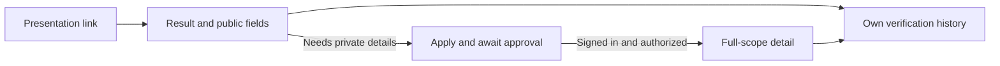

# Verifier — understand the result without overstating trust

Draft for [#33](https://github.com/XRPL-Commons/XCS/issues/33).

User goal: “I want to know whether this shared attestation is current, what was checked, and whether
I am allowed to see the details I need.”

[French board](./wireframes.fr.excalidraw) · [English board](./wireframes.en.excalidraw) ·
[Gallery](../index.html#verifier)

## Journey and screens

The anonymous happy path is one screen, V2. V1 is optional for public verification and must never
block viewing the allowed subset. V3 is the authorized state of that same presentation page.

| Screen / suggested route                      | Question answered                                | Action                                                                              |
| --------------------------------------------- | ------------------------------------------------ | ----------------------------------------------------------------------------------- |
| [V1](./v1.fr.svg) `/verifier/apply`           | How can I request full-detail access?            | Organization, purpose, contact; application/pending/declined states                 |
| [V2](./v2.fr.svg) `/p/:token` public tier     | What can I conclude from the evidence I can see? | One headline, four separate dimensions, public fields, sign-in/access guidance      |
| [V3](./v3.fr.svg) `/p/:token` authorized tier | Are these the complete, checked details?         | Full fields only if scope AND viewer authorization allow; digest evidence on demand |
| [V4](./v4.fr.svg) `/verifier`                 | What did I check previously?                     | Own metadata-only history and CSV export; reopen rechecks access and token validity |

V1 pending explains that global application approval and recipient-authorized sharing are distinct.
Declined shows the reason and a contact route when defined, without implying an automatic appeal.
An approved verifier still needs a full-scope recipient grant addressed to its own authenticated
application identity. A forwarded link from another approved verifier does not qualify. A
public-scope link never silently upgrades because the viewer signed in. Admin approval is portal
permission, not issuer trust. No issuer-specific approval is required under ADR 0004.

V4 may retain time, result category and an application record reference under a reviewed retention
policy; never payload claims or reusable bearer tokens. CSV uses the same authorization and
spreadsheet-safe escaping. Anonymous history is not recorded as an identified verifier's activity.

## Headline and evidence

The headline is a plain-language summary, never a numerical or universal trust score. The four
dimensions remain visible separately: ledger lifecycle, schema validity, payload integrity and
issuer trust. A 390 × 844 viewport must show the headline and its limitation without scrolling.

1. Unusable presentation: show no credential details, even to a previously approved viewer.
2. Missing/stale evidence: “Cannot verify now”, never a previous green result.
3. With current evidence, disclose proven revocation/expiry/content mismatch as the headline;
   if several apply, explain each in the dimension list rather than hiding them.
4. Missing full-byte check: “Partially checked” / “Vérification partielle”; explicitly “Payload:
   not checked”. Do not compute a full-payload digest from a filtered subset.
5. Full technical checks passed but issuer trust is unknown: “Issuer not recognized”, with the
   technical facts below. Unknown does not mean fraudulent, and approval does not make it trusted.
6. “Checks passed” / “Contrôles réussis” requires current accepted lifecycle, valid schema and
   payload, plus a separately established viewer trust decision. Explain that this does not prove
   the real-world truth of claims. Never derive trust from Commons application approval.

For an unapproved viewer, the access hint explains both steps: an administrator approves the global
verifier role; the recipient then grants this particular verifier access to the credential. The
recipient cannot approve a verifier role, and the administrator cannot grant access to private
claims. Avoid implying that a login or approval alone unlocks private fields.

Every current report value also needs an explicit display branch. Confirm presentation validity
and evidence freshness first; then give known failures priority over partial checks. Always show
the other dimensions alongside the headline, including when several fail.

| Evidence                 | English headline / French headline                          | Meaning                                                                   |
| ------------------------ | ----------------------------------------------------------- | ------------------------------------------------------------------------- |
| `onChain: pending`       | Not yet accepted / Pas encore acceptée                      | Issuance exists; subject acceptance is not proved                         |
| `onChain: not_found`     | Attestation not found / Attestation introuvable             | No matching generation in current evidence; not a schema or trust verdict |
| `onChain: expired`       | Attestation expired / Attestation expirée                   | Credential expiry; sharing has no automatic time limit                    |
| `onChain: deleted`       | Attestation no longer active / Attestation inactive         | Refine to revoked or declined only with the actual deletion cause         |
| `schema: invalid`        | Invalid schema / Schéma invalide                            | An established failure; cannot be summarized as partly valid              |
| `schema: unknown`        | Schema not resolved / Schéma non résolu                     | Incomplete evidence; no success headline                                  |
| `payload: tampered`      | Content mismatch / Contenu altéré                           | Digest mismatch                                                           |
| `payload: invalid`       | Invalid content / Contenu invalide                          | Full content fails format or schema checks                                |
| `payload: unavailable`   | Content unavailable / Contenu indisponible                  | Retrieval failed; not proof of tampering                                  |
| `payload: not_checked`   | Partially checked / Vérification partielle                  | Check not performed, including filtered public views                      |
| `issuerTrust: untrusted` | Issuer not trusted / Émetteur non fiable selon vos critères | Explicit negative trust decision, not merely unknown                      |
| `issuerTrust: unknown`   | Issuer not recognized / Émetteur non reconnu                | No trust conclusion; separate from application approval                   |

For multiple current negative findings, order the headline by lifecycle, schema, payload, then
issuer trust, with all failures visible. Known negatives precede unknown/unavailable dimensions.
The no-score rule still applies: this ordering is display priority, not arithmetic over trust.

## Current asks → proposed simplification

| Existing `/verify` / exact credential detail        | Proposed presentation view                                                        |
| --------------------------------------------------- | --------------------------------------------------------------------------------- |
| Credential tuple / generation ID / transaction hash | Resolve server-side from valid presentation                                       |
| Schema, digest, payload URL and separate reports    | Human-readable result first; preserve evidence on demand                          |
| Explicit external-host fetch and trust choice       | Explain exactly what was checked and by whom; keep consent if fetching externally |
| Manual record keeping                               | Authorized metadata-only history; no payload retention                            |

## Failure and empty states

- Wallet missing (F1): public verification does not need a wallet; never send the viewer through
  wallet setup to read the public subset. Linking is only needed for separately requested features.
- Invite expired (F2): applies to recipient onboarding, not verifier access. For a revoked sharing
  grant, ask the recipient to share again; no presentation renewal or expiry countdown.
- Indexer unavailable (F3): result is unavailable; retry with fresh evidence, no stale green card.
- Unapproved/wrong designated identity: return only public fields plus access guidance, including
  in SSR. A previously authorized viewer who loses approval cannot keep reading private data.
- No history: “No checks recorded” / “Aucune vérification enregistrée”; open a presentation link.
- Session expired: sign in again and recheck audience/approval/grant; the sharing grant itself has
  no automatic expiry. Reopened history always uses current authorization and ledger evidence.

## Review and acceptance tasks

Two verifier participants explain a public-tier result at first glance, request access, inspect a
full-scope authorized example, then distinguish revoked, expired, unknown issuer, tampered and
unavailable cases. Ask what they can conclude about the truth of the attestation. Check that a
different globally approved verifier does not expect private access from a forwarded link, and that
recipient revocation or loss of approval blocks future access without changing ledger validity.

#33 implements V1–V4 and F3; tests every viewer/scope combination from the shared matrix at the API
boundary and keeps dimensions independent. Record actual results in [the session log](../usability.md).
